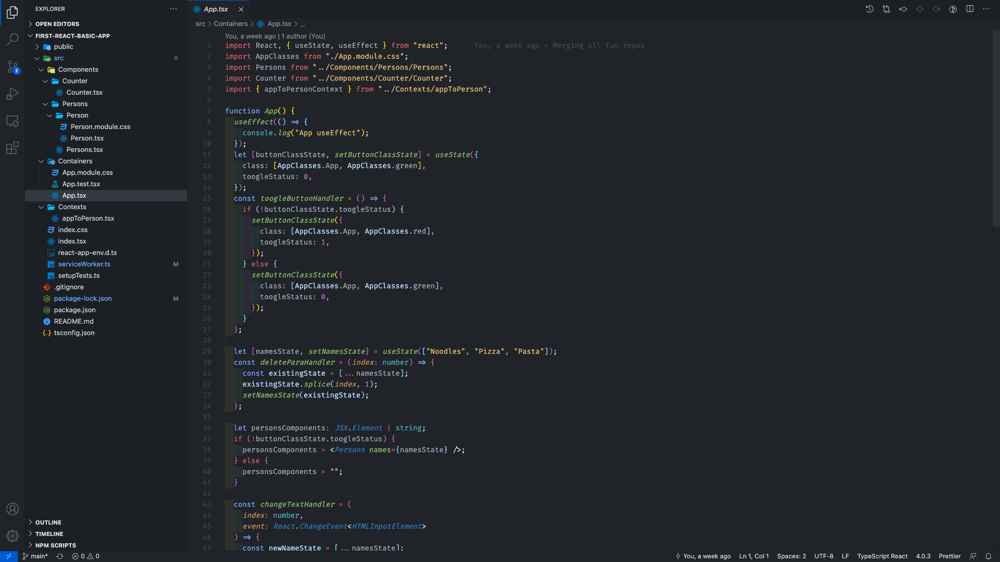
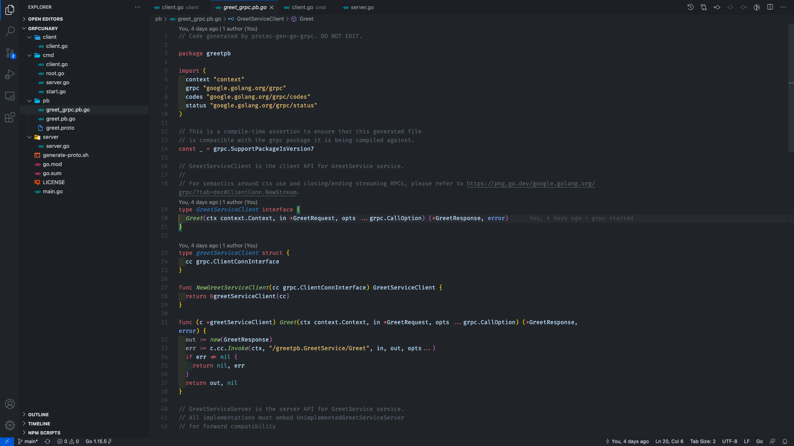

# Night Walk

Do you write code late night and go out for tea 🍵 to refresh❓

Having tea 🍵 at streets in cold nights is so relieving. :relieved:
And sitting at the city park bench, taking a deep breath after successful compilation of code is really worth it. ✌️

The colour scheme is influenced by the cold breeze, tea and colorful playground equipments like seasaw etc.

## Installation

1. Open **Extensions** sidebar panel in Visual Studio Code. `View → Extensions`
1. Search for `Night Walk`
1. Click **Install**
1. Click **Reload**
1. File > Preferences > Color Theme > **Night Walk**

### Font

I haven't included any font in this release as I know that it's a very personal preference. The font I use (that is seen in the image above) is [Fira Code](https://github.com/tonsky/FiraCode), which I recommend if you're a fan of ligatures.

### Feedback

If you have suggestions, please [open an issue](https://github.com/parthw/vscode-night-walk-theme/issues) or better yet, a [pull request](https://github.com/parthw/vscode-night-walk-theme/pulls).

Be nice. 😄

## Credits

Credit where credit is due... when I started writing this theme, I don't have any ideas where to put which color. There are so many themes I took reference from and to understand the design patterns i.e. Visual Studio Dark+, Monokai, Winter is Coming, Github Vscode theme, Tokyo Night and and Celestial.
